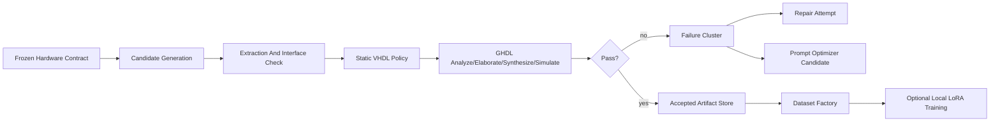

# VHDL Improvement Lab Architecture

## Goal

The lab is a verification-guided improvement loop for VHDL generation. It separates three mechanisms that should not be mixed: prompt improvement, accepted code/dataset creation, and model fine-tuning.

## Flow

## Design Principles

- Contracts are frozen before generation.
- The entity interface is preserved exactly.
- The model returns one artifact at a time.
- Verification failures create normalized clusters, not vague prose history.
- Prompt candidates must pass benchmark/holdout gates before promotion.
- Training uses only accepted or explicitly labeled repair-pair data.

## Storage

The first implementation uses local JSON and artifact directories under `data/vhdl-lab`. This keeps the feature deployable without adding migrations or a database dependency.
